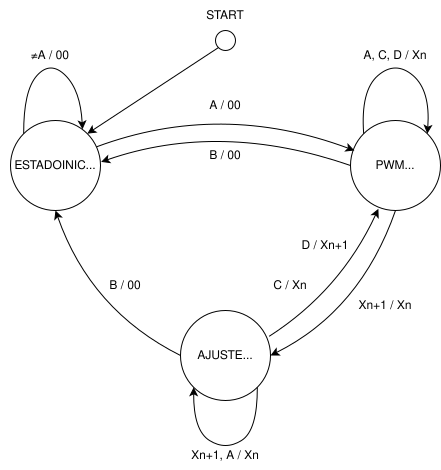

# Unidad 3
## Documentación del Proyecto
 
Nombre del estudiante: Jerónimo Quintero Chavarría  
ID: 000492388

---
## Actividad 1

### Ejercicio 1

¿Cuáles son los lenguajes en los que se puede programar sistemas embebidos y qué ventajas y desventajas tienen dichos lenguajes comparados con C?

- **C:** Es el lenguaje más utilizado en programación de sistemas embebidos debido a su eficiencia y control a bajo nivel. Permite manipular directamente hardware y optimizar el uso de recursos.

- **C++:** Aunque es más pesado que C, C++ ofrece características de programación orientada a objetos, lo que puede facilitar la gestión de proyectos más complejos y la reutilización de código.

- **Assembly:** Proporciona un control total sobre el hardware, permitiendo la programación a nivel de instrucción. Es ideal para aplicaciones donde el rendimiento y la optimización son críticos, aunque es más complejo y menos portable.

- **Python:** Aunque no es típico para sistemas embebidos debido a su overhead, con plataformas como MicroPython o CircuitPython, se puede usar para prototipos rápidos y aplicaciones menos críticas.

- **Java:** Utilizado principalmente en sistemas embebidos que requieren portabilidad, como dispositivos móviles y algunos dispositivos IoT. Sin embargo, no es tan común como C o C++ en entornos con recursos limitados.

- **Rust:** Un lenguaje más reciente que proporciona seguridad en la gestión de memoria y concurrencia sin sacrificar el rendimiento, haciéndolo atractivo para sistemas embebidos modernos.

- **Ada:** Utilizado en sistemas críticos (como aeronáutica y defensa) por su robustez y características de programación segura. Es menos común, pero muy valorado en entornos donde la fiabilidad es clave.

- **Verilog/VHDL:** Lenguajes de descripción de hardware utilizados para diseñar circuitos integrados y FPGA. Permiten definir la estructura y el comportamiento del hardware.

- **Lua:** Utilizado en sistemas embebidos para la programación de scripts y en dispositivos como routers y sistemas de domótica. Es ligero y fácil de integrar.

**FALTA**

---
### Ejercicio 2

Crear tres macros en C

1. Aplicar una máscara para escribir en un registro del microcontrolador
~~~c
#define MASK_OR_REG(reg, mask) ((reg) |= (mask))
~~~

2. Determinar si un periférico está presente en el microprocesador
~~~c
#define VER_PERI(PCC) ((PCC) & (1 << 31)) 
~~~

3. Alternar un bit de un registro
~~~c
#define TOGGLE_BIT(reg, bit) ((reg) ^= (1 << (bit)))
~~~
---

### Ejercicio 3

---

### Ejercicio SDK

Cambié el puerto E9 por el puerto B12: se cambia *BOARD_INITPINS_LED_RED_GPIO* que era antes *GPIOE* por *GPIOB* y se cambia *BOARD_INITPINS_LED_RED_PORT* que era antes *PORTE* por *PORTB*, además se cambió *BOARD_INITPINS_LED_RED_PIN* que era antes *9U* por *12U*.

En el clock control (línea 66 de pin.mux.c) se cambió *CLOCK_EnableClock(kCLOCK_PortE)* por *CLOCK_EnableClock(kCLOCK_PortB)*.

## Proyecto - Encendido de un LED usando un teclado 4x4

Se usará el microcontrolador para controlar la intensidad de un LED mediante un teclado matricial y una señal PWM. Se implementa la técnica de multiplexación para leer el teclado, una máquina de estados finitos para gestionar el flujo del programa, y el PWM del módulo FTM (FlexTimer Module) para variar el brillo del LED en función del ciclo útil, que el usuario puede ser ajustado ingresando valores entre 1% y 99%.

### Diagrama de estados

---

Se diseño el diagrama de estados en base a una máquina de Mealy que posee 3 estados: ESTADO INICIAL, PWM ACTIVADO Y AJUSTE PWM.

    

**Funcionamiento**

**Estados:**

- **Estado Inicial:** Aquí el sistema está esperando una entrada del usuario. El LED está apagado y el PWM no está activo.

  **Transición:**
  - Si se presiona una tecla diferente de 'A', el sistema permanece en el estado inicial. La salida es el ciclo útil del PWM, que en este caso es 0.
  - Si se presiona 'A', el sistema pasa al estado de PWM Activado. La salida es 0.

- **PWM Activado:** En este estado, el PWM está funcionando, y el LED varía su intensidad según el ciclo útil actual $X_n$

  **Transición:**
  - Presionar la tecla 'B' regresa al estado Inicial y el PWM se apaga. La salida es 0.
  - Presionar un nuevo numero, es decir, definir un nuevo ciclo útil $X_{n+1}$, ocasiona que se pase al estado Ajuste PWM. La salida es el ciclo útil actual $X_n$.
  - Presionar 'A', 'C' o 'D' en este estado no cambia nada, se queda en PWM Activado con el mismo ciclo útil. La salida es el ciclo útil actual $X_n$.

- **Ajuste PWM:** Aquí el usuario puede ajustar el ciclo útil del PWM para controlar la intensidad del LED.

  **Transición:**
  - Presionar 'D' confirma el nuevo ciclo útil $X_{n+1}$ y vuelve al estado PWM Activado. La salida es el nuevo ciclo útil $X_{n+1}$.
  - Presionar 'C' descarta el cambio y mantiene el ciclo actual $X_n$, regresando también a PWM Activado. La salida es el ciclo útil actual $X_n$.
  - Si se presiona 'A' o se ingresa el nuevo ciclo útil $X_{n+1}$, el sistema vuelve al estado Ajuste PWM para seguir haciendo cambios. La salida es el ciclo útil actual $X_n$.
  - Presionar 'B' apaga el PWM y regresa al estado Inicial. La salida es 0.

### Funcionamiento del PWM

---

En el siguiente video se puede apreciar el funcionamiento del PWM en el microcontrolador utilizando el PIN C10.

(El video se encuentra en la carpeta IMG de este mismo repositorio)

### Implementación de la técnica de multiplexación

---

Aún no se ha podido implementar la técnica de multiplexación por motivos de tiempo.

